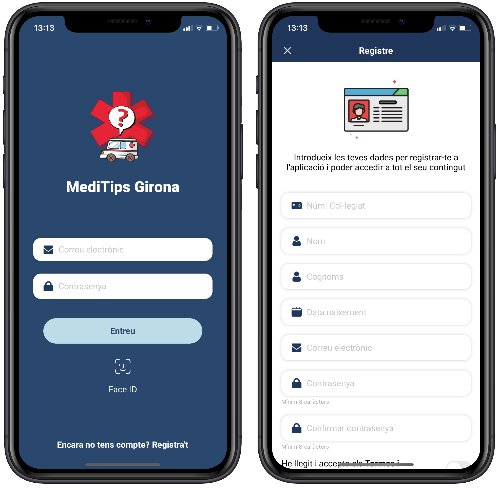
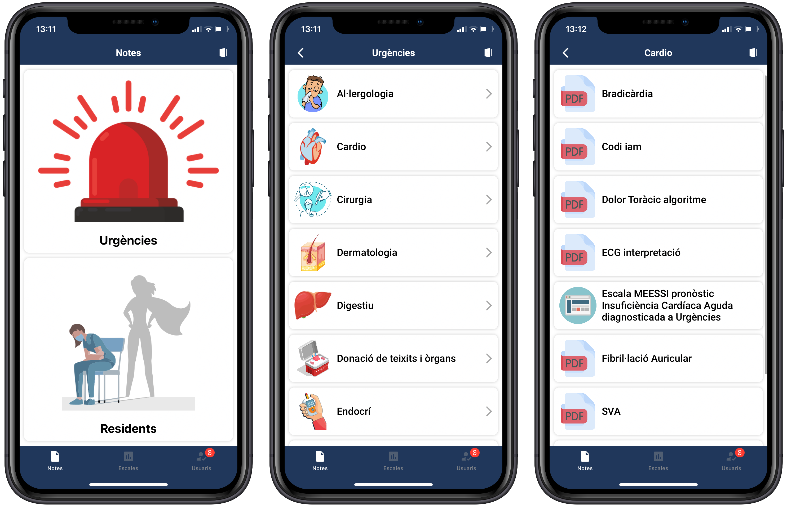
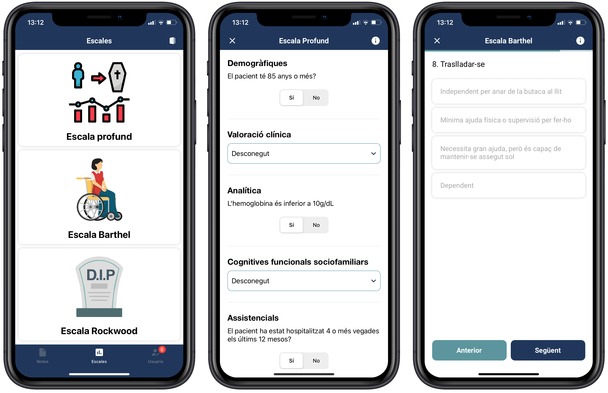
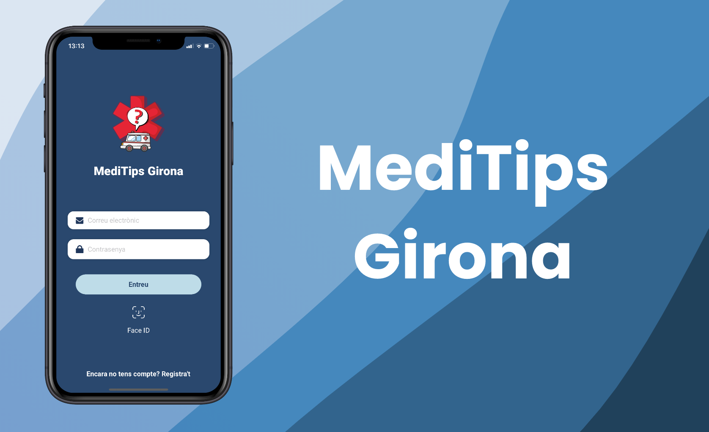

 

 

# MediTips Girona

 

- [Introduction](#introduction)
- [Platforms](#platforms)
- [Management](#management)
- [Requirements](#requirements)
- [Technology](#technology)
- [Screenshots](#screenshots)
- [Demo](#demo)

## Introduction

MediTips Girona is a mobile application that born from the need of the professionals of the emergency service in the **[University Hospital of Girona Dr. Josep Trueta](https://icsgirona.cat/ca/hospitaltrueta)** and the **[IdIBGi](https://idibgi.org)** to have at hand useful information such as summaries, diagrams, algorithms, leaflets, and others, which they use every day, on the main health problems in urgency. In addition, this application helps external professionals, as well as resident doctors, to access them quickly and easily.
The content of this application is dynamic and can be modified by the manager to add and remove the content using the [Firebase](https://firebase.google.com) platform.

Nowadays, this application is already deployed and used by the emergency personal of the hospital.

## Platforms

A mobile application for medical teams developed with Swift 5 and Kotlin. Implements differents library to add more feature like push notifications with OneSignal, Flurry (to track the user interaction with the application) among others. Using Firebase allows them to retrieve content and view all needed information. 
The application is available on **[Play Store](https://play.google.com/store/apps/details?id=org.idibgi.meditipsgirona)** and **[App Store](https://apps.apple.com/es/app/meditips-girona/id1550588530)**.

## Management

The users can register to the platforms and there are some users defined with admin privileges that can validate new users to enter into the application. This admin user can access Firebase to upload new content, and the rest of the users can view this content.

## Requirements

- Android
    - Minium SDK API 23
    - 47MB of free space in the device

- iOS
    - iOS 11.O
    - 26,4MB of free space in the device

## Technology

- MVC
- [Alamofire](https://github.com/Alamofire/Alamofire)
- [Firebase](https://firebase.google.com)
- [CoreData](https://developer.apple.com/documentation/coredata)
- [Swift 5](https://www.swift.org)
- [Kotlin](https://kotlinlang.org)
- [Glide](https://github.com/bumptech/glide)
- [Flurry](https://www.flurry.com)
- [CocoaPods](https://cocoapods.org)

## Screenshots
In the image below can see some screenshots of the application for iOS.

## Demo

Quick demo of the application and the functionality in [YouTube](https://youtu.be/0PZZ-AEs1hQ).

**Copyright © 2021 Kevin Costa. All rights reserved.**